**目录：**

[TOC]

# 0. 文档版本变更信息

| 版本 | 日期       | 改动记录 |
| ---- | ---------- | -------- |
| V1.0 | 2024/08/07 | 正式发布 |
|      |            |          |
|      |            |          |


# 1. 简易电机控制配件板介绍

## 1.1 硬件资源介绍：

|        接口         |            数量            |
| :-----------------: | :------------------------: |
|       CAN标准       |             1              |
|        RS485        |             1              |
|        UART         |             1              |
|      OLED屏幕       |             1              |
|        按键         |             4              |
|        LED灯        |       3个（RGB三色）       |
| 用户SWD烧录调试接口 | 1（1.25 4pin无锁扣端子线） |
|      电源接口       |          多种类型          |

如下图所示，配件板主要分为Type-C供电接口、SWD烧录调试接口、屏幕显示、按键、以及电机通信接口的五个区域

<div>		<!--块级封装-->
    <center>	<!--将图片和文字居中-->
    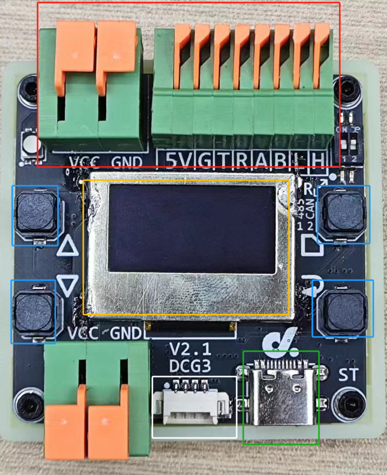
    <br>
        配件板硬件分区实物示意图
    </center>
</div>


|   硬件   |                           功能用法                           |
| :------: | :----------------------------------------------------------: |
|  接线区  | 连接电机通信接口（485/CAN/UART等），控制驱动的信号从这里发出给到电机 |
| 屏幕显示 |                           显示信息                           |
|   按键   |      分为4个按键，分别为上翻页、下翻页、确定、返回按键       |
|  Type-C  |                       供电以及USB通信                        |
| SWD接口  |              用户烧录调试接口，可自定义编程开发              |


**目前支持的标品电机型号：**

|      型号      | 通信方式 |       开发板是否支持        |
| :------------: | :------: | :-------------------------: |
| M0601C_111/411 |  RS485   |             是              |
|   M0602C_112   |  RS485   |             是              |
| M0603C_111/211 |   串口   |             是              |
|   M1502E_111   |   CAN    |             是              |
| M1502D_133/233 |   CAN    |             是              |
|   M1505A_222   |   CAN    |             是              |
|    P1010A/B    |   CAN    |             是              |
| M0603A_111/411 | LIN总线  | 是(需搭配UART转LIN转换模块) |


# 2. 使用步骤参考

## 2.1 物品准备

1.  Type-C USB数据线
2.  配件板出厂已经默认烧录代码
3.  需要控制的电机以及直流电源
4.  导线以及连接器
5.  1.25 4pin无锁扣端子线（如需自定义烧录调试）


## 2.2 开启CAN终端电阻拨码开关

使用前需要将CAN终端电阻的拨码开关拨到ON方向

如下图丝印所示，左边拨码开关控制RS485,右边拨码开关控制CAN，将右边拨码开关拨至上方（即ON方向）

<div>		<!--块级封装-->
    <center>	<!--将图片和文字居中-->
    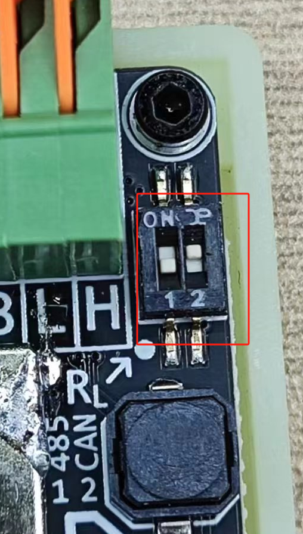
    <br>
        终端电阻位置示意图
    </center>
</div>


## 2.3 配件板供电

1.  首先使用Type-C数据线给配件板上电，OLED屏幕会显示欢迎页面，程序初始化中，如下图所示：

    <div>		<!--块级封装-->
        <center>	<!--将图片和文字居中-->
        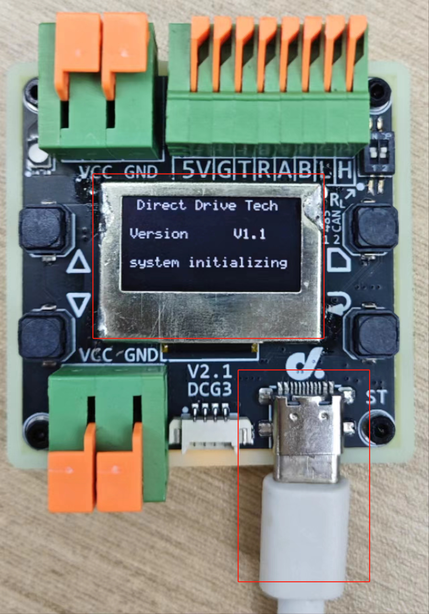
        <br>
            初始化页面示意图
        </center>
    </div>

    

2.  待 1s 时间初始化完成后，进入一级页面，这里的页面功能是选择要控制驱动的电机型号，默认从第一个开始

    <div>		<!--块级封装-->
        <center>	<!--将图片和文字居中-->
        
        <br>
            一级页面示意图
        </center>
    </div>

## 2.4 电机上电

查阅需要控制的电机对应的使用参考文档，将电机上电以及固定等，步骤如下：

1.  直流电源上电，电压调至电机**额定电压**，调好后关电

2.  将电机固定好

3.  将电机通信接口信号线与配件板上接线区的对应端子连接

    例如 ：以M1502D等的CAN 接口的电机接线如图所示

    <div>		<!--块级封装-->
        <center>	<!--将图片和文字居中-->
        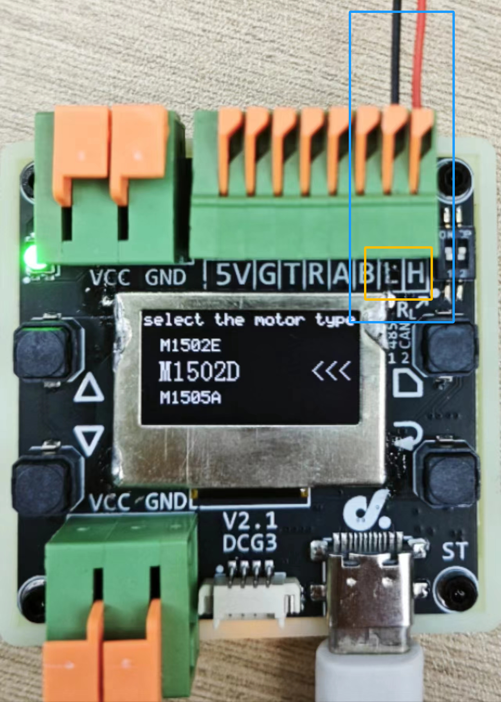
        <br>
            CAN 接线示意图
        </center>
    </div>


```c
注：更多电机接线参考请查看第三章部分
```


## 2.5 一级页面：选择电机型号

在完成上述供电操作以及等待初始化完成后，顺利进入一级页面，如下图所示：

<div>		<!--块级封装-->
    <center>	<!--将图片和文字居中-->
    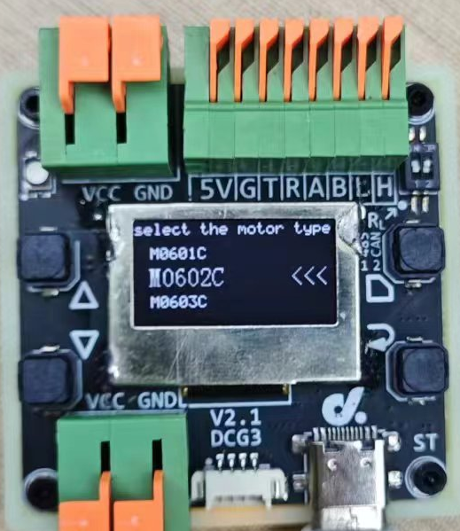
    <br>
        一级页面示意图
    </center>
</div>


一级页面下是显示被选中的要控制驱动的电机型号，可以看到，当前被选中的电机型号会明显大于上下两个待切换的电机型号，且文字右侧带有箭头指示

在一级页面下，各个按键的操作：

|  按键  |                  对应功能                  |
| :----: | :----------------------------------------: |
| 上翻页 |                选择电机型号                |
| 下翻页 |                选择电机型号                |
| 返回键 |                     无                     |
| 确定键 | 进入二级页面（显示电机信息，选择控制速度） |


------


**选择想要控制驱动的电机型号的步骤如下：**

1.   通过**上翻页按键**和下翻页按键切换电机型号
2.   同时观察屏幕显示区域
3.   确定选中到要控制驱动的电机型号后，按下**确定键**进入二级页面，进而调整控制速度


## 2.6 二级页面：调整控制速度

在完成上述选择电机操作按下**确定键**后，顺利进入二级页面，如下图所示：

<div>		<!--块级封装-->
    <center>	<!--将图片和文字居中-->
    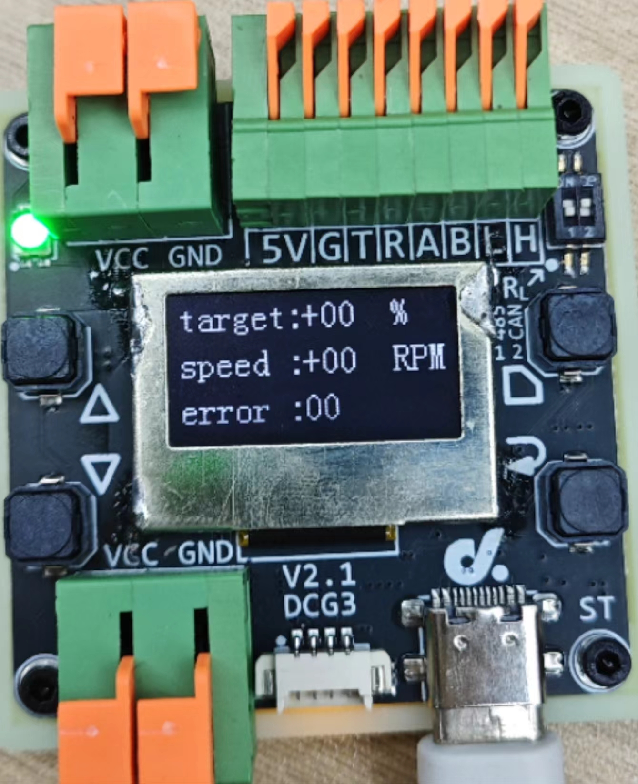
    <br>
        二级页面示意图
    </center>
</div>


二级页面下是控制电机速度，同时能反馈电机实时速度，显示在屏幕区域，二级页面电机信息主要 有3行：

|         列表         |                           显示信息                           |
| :------------------: | :----------------------------------------------------------: |
|        第一行        |                  目标速度（电机百分比速度）                  |
|        第二行        |                 电机实时反馈速度（单位RPM）                  |
|        第三行        |                 根据电机型号不同显示不同信息                 |
| 第三行：电机错误信息 | 电机错误信息(十进制显示,为零代表电机状态正常，非零值查看电机规格书详细说明） |
|   第三行：电机温度   |                     电机温度，单位摄氏度                     |

二级页面操作：

|  按键  |                      对应功能                      |
| :----: | :------------------------------------------------: |
| 上翻页 | 选择电机百分比速度（无需按下确定按键电机即可转动） |
| 下翻页 | 选择电机百分比速度（无需按下确定按键电机即可转动） |
| 返回键 |          返回一级页面（重新选择电机型号）          |
| 确定键 |                         无                         |


**具体操作步骤如下：**

1.  使用**上翻页按键**、**下翻页按键**选择电机**百分比**速度（目前支持正负**10个百分比**档位速度）

    <div>		<!--块级封装-->
        <center>	<!--将图片和文字居中-->
        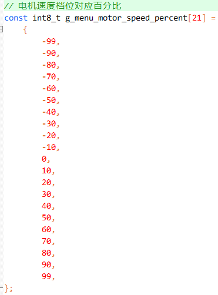
        <br>
           正负10个档位速度示意图
        </center>
    </div>
    
    
2.  使用**上翻页按键**、**下翻页按键**选择电机百分比速度，电机即可开始转动（无需按下确定按键）

3.  屏幕上显示选择的电机百分比速度以及电机实时RPM转速

    如下图所示（以M1502D为例）：

    <div>		<!--块级封装-->
        <center>	<!--将图片和文字居中-->
        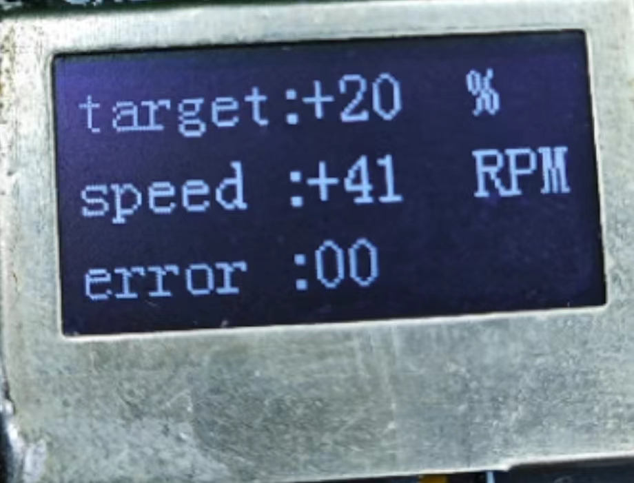
        <br>
           +20% 速度示意图
        </center>
    </div>

    

    <div>		<!--块级封装-->
        <center>	<!--将图片和文字居中-->
        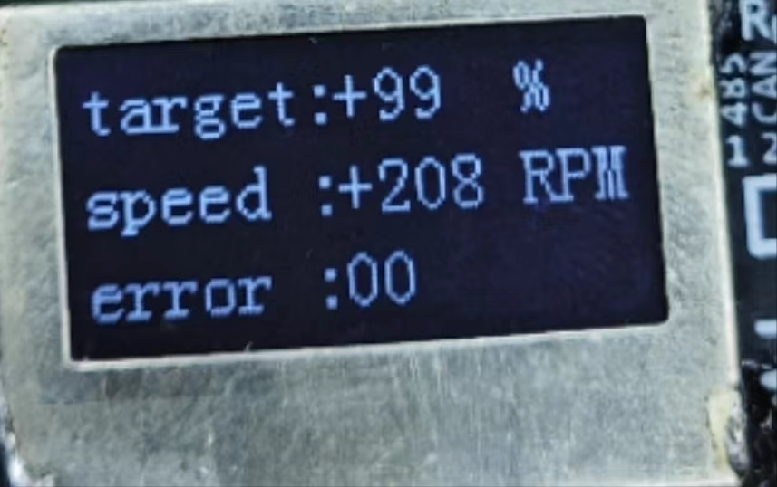
        <br>
           +99% 速度示意图
        </center>
    </div>

    

    <div>		<!--块级封装-->
        <center>	<!--将图片和文字居中-->
        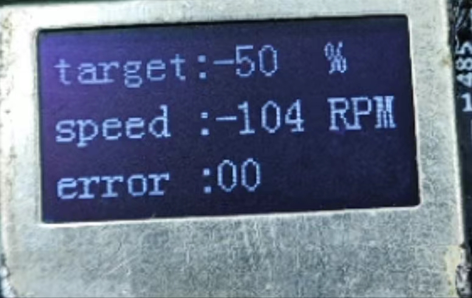
        <br>
           -50% 速度示意图
        </center>
    </div>

    

    <div>		<!--块级封装-->
        <center>	<!--将图片和文字居中-->
        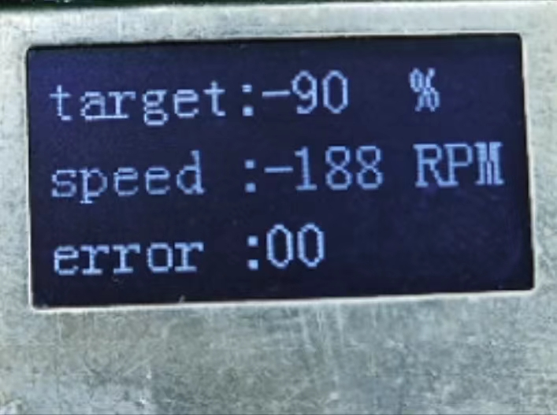
        <br>
           -90% 速度示意图
        </center>
    </div>

    

    

    **注意**：如果电机驱动不成功，可以查看下第三行电机错误信息(十进制)，为零代表电机状态正常，非零值查看电机规格书详细说明

    如下图所示，是型号为M0602C的电机，电机期望为20%，但是观察发现实际电机转速为0，而第二行显示的转速为553RPM，明显错误

    

    <div>		<!--块级封装-->
        <center>	<!--将图片和文字居中-->
        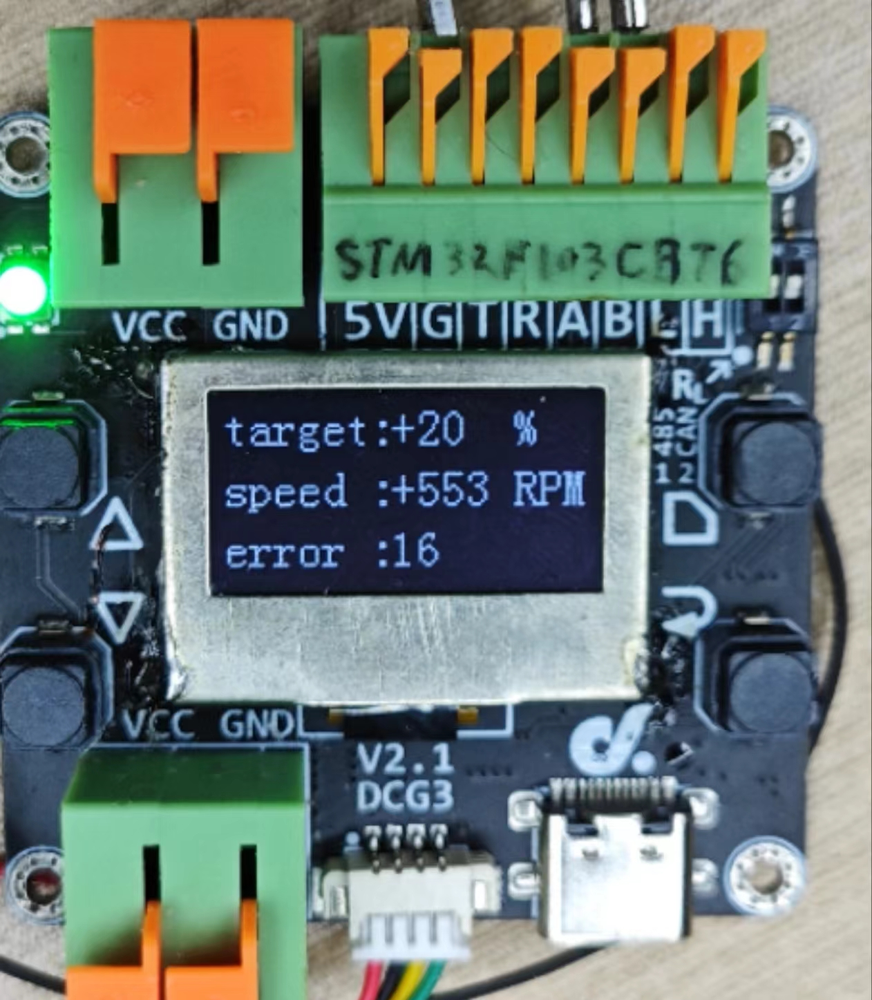
        <br>
           显示电机错误码示意图
        </center>
    </div>

    

    第三行显示16，十进制为0x10,查看电机规格书关于错误码的部分：

    <div>		<!--块级封装-->
        <center>	<!--将图片和文字居中-->
        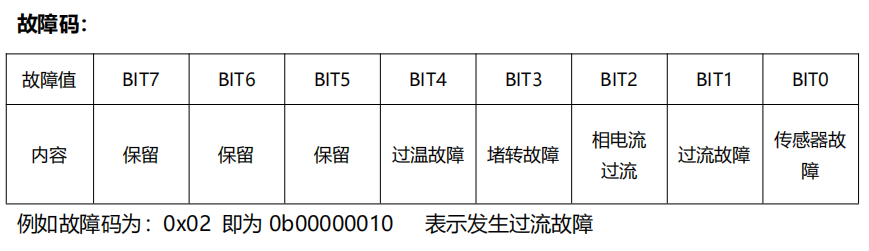
        <br>
           电机规格书中故障码部分截图
        </center>
    </div>

    

    即电机过温故障

4.  在二级页面按下返回键返回一级页面（重新选择电机型号）


# 3. 各种电机接线参考

## 电机接线参考：CAN通信

电机使用CAN通信，电机的CAN_H / CAN_L连接到配件版的接线区的 H / L 接口

| 电机端 | 配件板端(看丝印) |
| :----: | :--------------: |
| CAN_H  |        H         |
| CAN_L  |        L         |

```
注：无其他需要GND无需接
```

例如：下图为P1010A 电机 CAN 信号线接线示意图

<div>		<!--块级封装-->
    <center>	<!--将图片和文字居中-->
    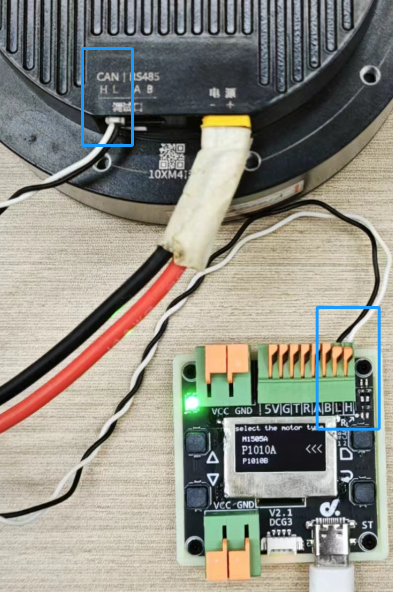
    <br>
       CAN 信号线接线示意图
    </center>
</div>


##                                                                                                                                                                                                                                                                                                                                                                                                                                                                                                                                                                                                                                                                   电机接线参考：RS485通信

电机使用RS485通信，电机的RS485_A / RS485_B 连接到配件版的接线区的 A / B 接口

| 电机端  | 配件板端(看丝印) |
| :-----: | :--------------: |
| RS485_A |        A         |
| RS485_B |        B         |

```
注：无其他需要GND无需接
```

例如：下图为M0601C 电机 RS485 信号线接线示意图

<div>		<!--块级封装-->
    <center>	<!--将图片和文字居中-->
    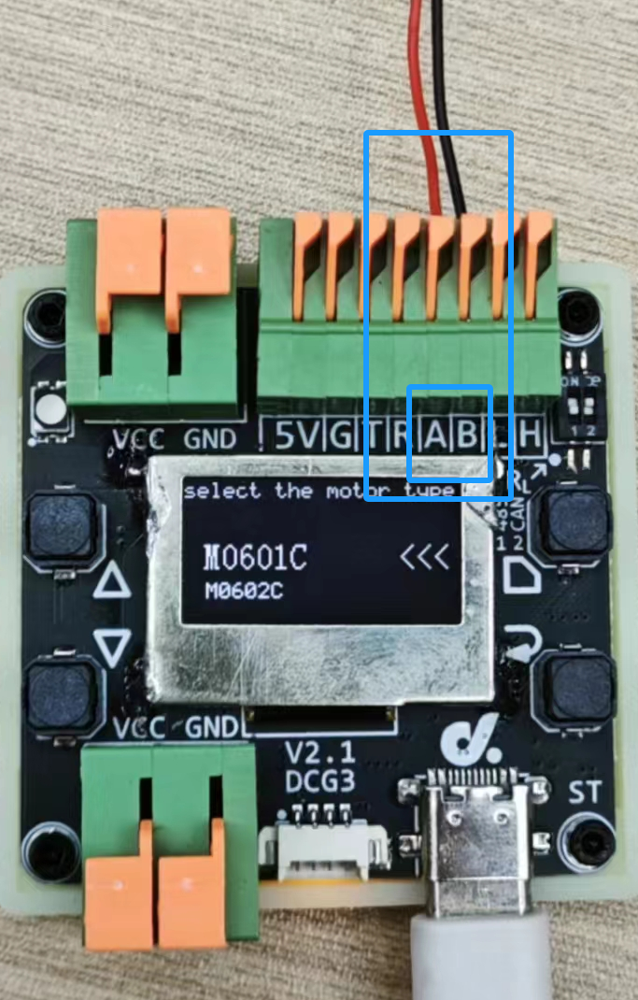
    <br>
       RS485 信号线接线示意图
    </center>
</div>


## 电机接线参考：UART通信

电机使用UART通信，电机的通信接口连接配件板的接口:

|   电机端    | 配件板端(看丝印) |
| :---------: | :--------------: |
|   UART_TX   |        R         |
|   UART_RX   |        T         |
| 电机电源GND |        G         |

```
注：UART通信GND必须接，否则没有共地无法通信
```

例如：下图为M0603C 电机 UART 信号线接线示意图

<div>		<!--块级封装-->
    <center>	<!--将图片和文字居中-->
    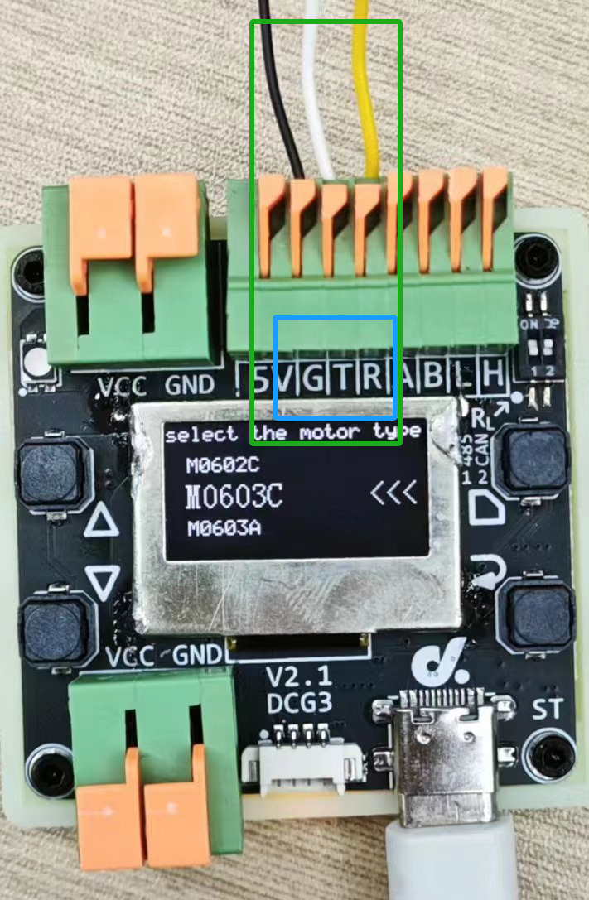
    <br>
       UART 信号线接线示意图
    </center>
</div>


### 电机接线参考：LIN通信

电机使用LIN总线通信，需要用到LIN 转 TTL 模块(关于此模块详情可看M0603A电机参考使用手册)

其中电机线束接口直接插连 LIN 转 TTL 模块对应母头。电源正负极分别和 LIN 转 TTL 模块正负极连接

LIN 转 TTL 模块的通信接口连接配件板的接口

| LIN 转 TTL 模块 | 配件板端(看丝印) |
| :-------------: | :--------------: |
|       TXD       |        T         |
|       RXD       |        R         |
|   电机电源GND   |        G         |

```
注：UART通信GND必须接，否则没有共地无法通信
```


# 4. 注意事项 & FAQ

**注意：**

1.  使用RS485与CAN总线通信控制电机时，不需要连接GND
2.  **使用UART（包括LIN 转 TTL 模块）控制电机时，必须连接GND，配件板的GND与电机电源共地，否则影响UART通信，无法控制**
3.  上电顺序：原则上配件板与电机上电顺序没有要求，建议先将线路连接好，给电机上电，再用Type-C数据线给配件板上电，接着选择型号等操作......
4.  必须在一级页面对电机上电，以下这种情况会导致电机控制失败：进入二级页面后，再对电机上电，此时因为电机ID设置，模式等不成功，驱动指令无法匹配电机内部指令，驱动失败，**此时可以返回到一级页面，选择电机型号后，重新进入二级页面**
5.  在测试完一个电机，更换另一个新电机后，**配件板可以不用重新上电，但是需返回到一级页面，选择电机型号后，重新进入二级页面**

**提示：**

1.  配件板为了支持列表里的所有电机型号，对将电机统一设置ID为1，设置模式为速度环

2.  二级页面的10个正负档位是百分比，对每个电机的空载转速做了计算处理，所以不同型号电机同样的百分比速度下对应的转速（RPM）是不一样的

    

------


**F:** 为什么接上电机，选择速度后无法控制？

**Q:** 先检查连线，有些型号电机需要连接GND,再检查电机型号是否选择正确，如果是CAN通信电机检查拨码开关是否正确操作


**F:** 为什么有些电机在二级页面看不了温度？

**Q:** 根据电机型号不同，二级页面显示分为故障码和电机温度


